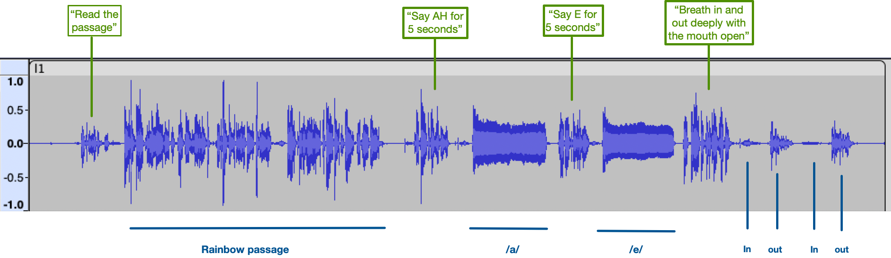

# Laryngeal cancer triage proof-of-concept

This repository contains code to process voice recordings and train a RF model to classify recordings for triage onto the appropriate treatment pathway (cancer or not cancer).

The inputs to the model are features extracted from a 3 second sample of the audio, such as the mean pitch, shimmer and jitter.

The output from the model is a classification "C" (1) for cancer, or "N" (0) for non-cancer.

# Software environment

This is primarily a Python 3.8 project, with scripts and notebooks.

This code was run on an Intel Mac hardware, using [Miniconda](https://docs.anaconda.com/miniconda/) for the environment.

Set up the environment with:

```
conda env create -f environment.yaml
conda activate lc-poc
```

You will also need to install Surfboard, which provides WAV manipulation code and also implements algorithms for extracting features from the audio. We installed this from source: <https://github.com/novoic/surfboard>

We used [ffmpeg](https://ffmpeg.org) for audio conversion, and [Audacity](https://www.audacityteam.org) to view the audio.

# Data

We have 107 records of which 9 have a cancer diagnosis.

## Recordings



The recordings contained a number of activities, of which we only processed the "ah" extended vowel sound.

The audio recordings are not included in this repository. They are `.m4a` format collected on a Trust iPhone. In the code here you will see references to folders such as `secret/luhft/2023-03-27/Recordings`.

## Associated demographic and classification data

For each recording, a spreadsheet (`AI data.xlsx`, not included here) gives:

- Study Number (integer)
- Gender (Male or Female)
- Age (integer)
- Smoker (Current, Non, Ex)
- Diagnosis (various, e.g., Normal or Right vocal cord paralysis)
- Voice recording (blank - contained the embedded audio file)
- Classification (C or N for cancer or non-cancer)

We did not use the demographic fields in this work.

## Alternative data sets

Useful alternative data sources, which we used to help size the models before training on the laryngeal cancer data:

- [Mobile Device Voice Recordings at King's College London (MDVR-KCL) from both early and advanced Parkinson's disease patients and healthy controls](https://zenodo.org/records/2867216#.ZBgghxXP0UE)

- [Assessment of Speech Intelligibility in Parkinson’s Disease Using a Speech-To-Text System](https://ieeexplore.ieee.org/document/8070308)


# Pipeline

## 1. Convert to WAV

Audio files were converted to WAV files, with a consistent sampling rate of 48000. See [resample.sh](https://github.com/salina-health/lc-poc/blob/main/resample.sh) for the commands.

## 2. Isolation of "ah" sound

We listened to each recording in Audacity, and logged the time (in seconds) just before the "ah" sound started. We created a new file (`AI data.csv`) and appended on two columns to those listed above:

- Start ah (time in seconds just before "ah" sound)
- Observations (text noting anything unusual)

An example observation might be "S (subject) gave two sounds; we took the second one".

The script [ah.py](https://github.com/salina-health/lc-poc/blob/main/ah.py) was used to read the CSV file and write out three seconds of audio starting from the "ah" sound. For example, for the first row, "Study number 1", we look for 'Study 0001.wav' and write "ah Study 0001 3 sec.wav".

We re-listened to the "ah" extracted audio to manually check for quality.

## 3. Data exploration

See the notebook [summary.ipynb](https://github.com/salina-health/lc-poc/blob/main/summary.ipynb) for initial exploration of the data.

## 4. Feature extraction and training

See [explore-rf-3sec.ipynb](https://github.com/salina-health/lc-poc/blob/main/explore-rf-3sec.ipynb).

The notebook is made up of three main parts:

1. Feature extracting, using Surfboard. This writes a file called `AI data with features 3 seconds.csv` which contains the classification data, study number, and then audio features. 

2. Training. We used 5-fold cross validation training with stratified split on the data (so each fold had some amount of positive data in it). We excluded columns will NaN/missing data for a feature.

    As the data is unbalanced, we used the `class_weights` feature of the RandomForestClassifier code to adjust for this.

3. Reporting. The last part of the notebook investigates the feature importance,  training on all data to see the effect.


## 5. Observations

The F1 metric was not as informative as we hoped. The problem here is capture all the true positives at the expense of false negatives. 


## 6. Next steps

- More data

- Consider F2 or alternative scoring. References here are: [Unbalanced breast cancer data classification using novel fitness functions in genetic programming](https://www.sciencedirect.com/science/article/abs/pii/S0957417419305767?via%3Dihub) via [Loss Functions and Metrics in Deep Learning](https://arxiv.org/abs/2307.02694).

- Transfer learning: consider using [HeaR](https://github.com/Google-Health/google-health/blob/master/health_acoustic_representations/README.md) to compute an embedding for the audio, and train this downstream task on that representation. Google have approved us for access to HeaR for this application.

# Related work

1. Sharma, M. et al. TBscreen: A passive cough classifier for tuberculosis screening with a controlled dataset. Science Advances 10, eadi0282 (2024).
2. Coppock, H. et al. Audio-based AI classifiers show no evidence of improved COVID-19 screening over simple symptoms checkers. Nat Mach Intell 1–14 (2024) doi:10.1038/s42256-023-00773-8.
3. Baur, S. et al. HeAR -- Health Acoustic Representations. Preprint at http://arxiv.org/abs/2403.02522 (2024).
4. Kaufman, J. M., Thommandram, A. & Fossat, Y. Acoustic Analysis and Prediction of Type 2 Diabetes Mellitus Using Smartphone-Recorded Voice Segments. Mayo Clinic Proceedings: Digital Health 1, 534–544 (2023).
5. Hunter, D. J. & Holmes, C. Where Medical Statistics Meets Artificial Intelligence. N Engl J Med 389, 1211–1219 (2023).
6. Xie, J.-C., Gan, Y., Liang, P., Lan, R. & Gao, H. Exploring robust computer-aided diagnosis of Parkinson’s disease based on various voice signals. Frontiers in Physics 10, (2022).
7. Toye, A. A. & Kompalli, S. Comparative Study of Speech Analysis Methods to Predict Parkinson’s Disease. Preprint at https://doi.org/10.48550/arXiv.2111.10207 (2021).
8. Sung, H. et al. Global Cancer Statistics 2020: GLOBOCAN Estimates of Incidence and Mortality Worldwide for 36 Cancers in 185 Countries. CA: A Cancer Journal for Clinicians 71, 209–249 (2021).
9. Health, T. L. D. Do I sound sick? The Lancet Digital Health 3, e534 (2021).
10. Fan, Z., Wu, Y., Zhou, C., Zhang, X. & Tao, Z. Class-Imbalanced Voice Pathology Detection and Classification Using Fuzzy Cluster Oversampling Method. Applied Sciences 11, 3450 (2021).
11. Fagherazzi, G., Fischer, A., Ismael, M. & Despotovic, V. Voice for Health: The Use of Vocal Biomarkers from Research to Clinical Practice. DIB 5, 78–88 (2021).
12. Byeon, H. Is Deep Learning Better than Machine Learning to Predict Benign Laryngeal Disorders? IJACSA 12, (2021).
13. Riley, R. D. et al. Calculating the sample size required for developing a clinical prediction model. BMJ 368, m441 (2020).
14. Mohammed, M. A. et al. Voice Pathology Detection and Classification Using Convolutional Neural Network Model. Applied Sciences 10, 3723 (2020).
15. Kim, H. et al. Convolutional Neural Network Classifies Pathological Voice Change in Laryngeal Cancer with High Accuracy. J Clin Med 9, 3415 (2020).
16. Gour, G. B., V.Udayashankara, Badakh, D. K. & Kulkarni, Y. A. Voice-Disorder Identification of Laryngeal Cancer Patients. International Journal of Advanced Computer Science and Applications (IJACSA) 11, (2020).
17. Devarriya, D., Gulati, C., Mansharamani, V., Sakalle, A. & Bhardwaj, A. Unbalanced breast cancer data classification using novel fitness functions in genetic programming. Expert Systems with Applications 140, 112866 (2020).
18. Deng, Y. et al. Global burden of larynx cancer, 1990-2017: estimates from the global burden of disease 2017 study. Aging (Albany NY) 12, 2545–2583 (2020).
19. Acharjee, A., Larkman, J., Xu, Y., Cardoso, V. R. & Gkoutos, G. V. A random forest based biomarker discovery and power analysis framework for diagnostics research. BMC Medical Genomics 13, 178 (2020).
20. Pons, J., Serrà, J. & Serra, X. Training neural audio classifiers with few data. Preprint at https://doi.org/10.48550/arXiv.1810.10274 (2018).
21. Bray, F. et al. Global cancer statistics 2018: GLOBOCAN estimates of incidence and mortality worldwide for 36 cancers in 185 countries. CA: A Cancer Journal for Clinicians 68, 394–424 (2018).
22. Dimauro, G., Di Nicola, V., Bevilacqua, V., Caivano, D. & Girardi, F. Assessment of Speech Intelligibility in Parkinson’s Disease Using a Speech-To-Text System. IEEE Access 5, 22199–22208 (2017).
23. Verikas, A. et al. Data dependent random forest applied to screening for laryngeal disorders through analysis of sustained phonation: Acoustic versus contact microphone. Medical Engineering & Physics 37, 210–218 (2015).
24. Teixeira, J. P., Oliveira, C. & Lopes, C. Vocal Acoustic Analysis – Jitter, Shimmer and HNR Parameters. Procedia Technology 9, 1112–1122 (2013).
25. Figueroa, R. L., Zeng-Treitler, Q., Kandula, S. & Ngo, L. H. Predicting sample size required for classification performance. BMC Medical Informatics and Decision Making 12, 8 (2012).
26. Wormald, R. N., Moran, R. J., Reilly, R. B. & Lacy, P. D. Performance of an Automated, Remote System to Detect Vocal Fold Paralysis. Ann Otol Rhinol Laryngol 117, 834–838 (2008).
27. Gelzinis, A., Verikas, A. & Bacauskiene, M. Automated speech analysis applied to laryngeal disease categorization. Computer Methods and Programs in Biomedicine 91, 36–47 (2008).


# How to cite this work

Dallaway, R., Goonatilake, S. (2023). Laryngeal cancer triage proof of concept. https://github.com/salina-health/lc-poc


```
@misc{lcpoc,
  author       = {Dallaway, R. and Goonatilake, S.},
  title        = {Laryngeal cancer triage proof of concept},
  year         = {2023},
  url          = {https://github.com/salina-health/lc-poc},
}
```

This project is co-funded by Salina Health Ltd and [Innovate UK](https://www.ukri.org/councils/innovate-uk/), the UK’s innovation agency.


    	
   


